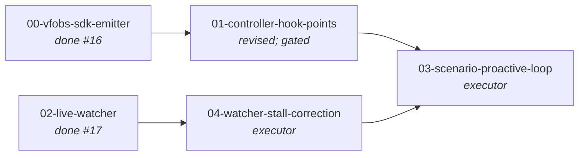

# Topology

**Post pre-impl-review restructure (operator-ratified
2026-05-16):** the T1 review found 2 blocking gaps (G1 no
`workgraph_id` in the controller; G2 harness is opaque ⇒ no
mid-run progress signal). Resolution: progress signal switched to
controller-side `task.workdir_changed` (DESIGN's own criterion);
`workgraph_id` added to `TaskInfo` at the worksource boundary.
That correction reopens the **already-merged T2** (its `Stall`
keyed on harness recency) → new task **T4** re-points it at
`task.workdir_changed`. T0 is signal-agnostic, unaffected. See
`plan.md` §D2/§D7/§D8/§D9 + `t1-preimpl-review.md`.

- **T0** — `vfobs-sdk-python`: a versioned, typed Emitter that
  wraps `POST /events`. Fire-and-forget + bounded + never raises
  into the caller. Lives in the vfobs repo (NFR5: the API ships
  with its SDK; the HTTP shape is an SDK implementation detail).
- **T1** — vafi controller hook points: call the Emitter at
  task.claimed, per-tick task.heartbeat, harness turn
  start/complete, and terminal task.state_changed (with
  execution_summary). Emission MUST be non-blocking and
  failure-isolated from the poll-claim-execute loop.
- **T2** — `vfobs-watch`: a CLI that consumes the WG2 read API
  (`/tasks/<id>/events`, `/events?filter`) and applies the G2
  thresholds client-side — approaching-timeout (>80% of
  taskTimeout, not terminal), stall (no harness turn advance for
  > T), crashed (heartbeat gap > T) — printing a live verdict.
  Independent of T0/T1 (consumes the already-live read API);
  parallel.
- **T3** — scenario: drive a real (or stub-harness) executor task
  with T1 instrumentation live, run T2 against it, assert the
  watcher flags a deliberately-stalled run BEFORE its timeout.
  The proactive-testing payoff, fail-loud (WG1-T6 precedent).

# Why this DAG

T0 is the contract everything else binds to (SDK-is-the-boundary).
T1 (producer) and T2 (consumer) are independent — T2 reads the WG2
API that already exists, so it can be built/tested against seeded
events in parallel with T1. T3 is the closing end-to-end proof and
the actual deliverable value: "we can see a stuck executor early."

# Engineering principles compliance

- **SOLID.** Emitter is an interface (Strategy: real HTTP emitter
  + a NullEmitter no-op for tests/disabled mode + a BufferingEmitter
  the watcher tests use). Controller depends on the Emitter
  abstraction (DIP), not httpx. Watcher's anomaly rules are a
  Strategy set (one rule = one class), so WG4 can later promote
  the exact same rule objects server-side.
- **TDD red/green + full pyramid.** Unit (Emitter fire-and-forget
  semantics; each anomaly rule), integration (Emitter vs a real
  vfobs; watcher vs real read API), contract (SDK pins the event
  envelope it sends against WG1 `event_schemas.v1.json`), scenario
  (T3 end-to-end on a real executor run).
- **Fail-safe is load-bearing.** Per the D-T0-1 lineage
  (observability is degradable, never on the critical path): a
  vfobs outage/slow-response/4xx MUST NOT raise, block, or
  measurably slow the controller loop. This is an explicit AC,
  not a nice-to-have.
- **Extensibility.** Emitter takes `org_id`/`cluster_id`
  passthrough; anomaly thresholds are config, not literals (so
  WG4's server worker reuses them); the SDK is semver'd per NFR5.

# Acceptance criteria (workgraph-level)

- WG-AC1 — All task PRs merged (vfobs SDK + watcher to
  viloforge/vfobs:main; controller hooks to vilosource/vafi).
- WG-AC2 — `make test-*` green on both repos' merge commits;
  zero regression to the vfobs WG1/WG2 suite and the existing
  vafi controller suite.
- WG-AC3 — **Fail-safe proven**: an integration test shows the
  controller loop completes a task normally when vfobs is
  unreachable / returns 5xx / times out (emitter swallows, logs
  once, does not raise or add unbounded latency).
- WG-AC4 — T3 scenario: a deliberately-stalled executor task is
  flagged by `vfobs-watch` as `STALLED` (and a near-timeout one as
  `APPROACHING_TIMEOUT`) **before** the task's own timeout would
  fire — the explicit "proactive instead of waiting" proof.
- WG-AC5 — SDK is versioned (semver, `__version__`) and the event
  envelope it emits is contract-pinned against WG1's locked
  `event_schemas.v1.json` (no ingest-schema drift — V17 lineage).
- WG-AC6 — vtaskforge task records for this workgraph done.

# Out of scope (explicit)

- **Server-side anomaly worker** (auto-acting G2 detector that
  posts `anomaly.*` events) — that is WG4. T2 applies the same
  rules *client-side* in the watcher; WG4 later lifts the rule
  objects server-side unchanged.
- **SSE / streaming** — WG3. T2 polls the WG2 read API.
- **Full controller instrumentation** (gate events, judge
  sub-stages, workdir-diff events) — later WG5 increments. This
  slice is the four signals needed for the stuck-detection use
  case.
- **Auto-intervention** (killing/retrying a stuck task) — the
  watcher *surfaces*; a human/agent decides. Auto-act is a
  separate policy workgraph.
- Cost-anomaly ("3× average") — WG4.

# References

- `viloforge-platform/docs/pipeline-observability-DESIGN.md`
  §3 (the pi-hang failure), §4 G1/G2, NFR5 (SDK is the boundary).
- `viloforge-projects/vfobs/workgraphs/read-api/` — the read API
  the watcher consumes; D-T0-1 (degradable) lineage for fail-safe.
- vafi controller: `vafi/src/controller/{controller,heartbeat,
  invoker}.py` — the hook surfaces (verified, see plan.md §D2).
- `vafi/vtf-sdk-python/` — the SDK packaging precedent T0 mirrors.
