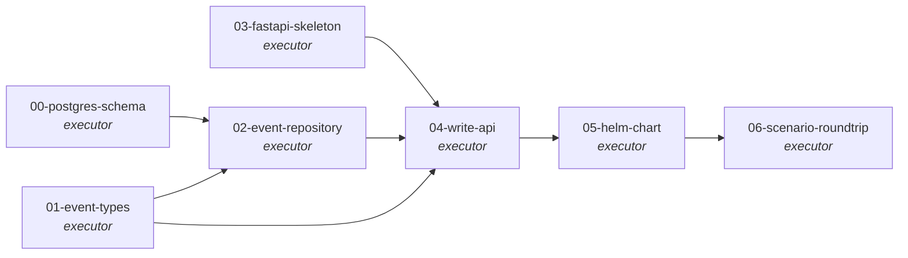

# Topology

Three tasks (T0 DB schema, T1 event types, T3 FastAPI skeleton) are
independent and can be implemented in parallel. T2 (EventRepository)
needs both T0 (table exists) and T1 (event types to serialize). T4
(POST /events) wires T2 and T3 together with T1's validators. T5
(Helm) packages the app from T4. T6 (scenario test) deploys via
T5's chart and verifies an end-to-end roundtrip in a kind cluster.

# Why this DAG

The plan's locked architecture commitments
(`viloforge-platform/docs/pipeline-observability-DESIGN.md` §7.5)
imply a clean separation between event-data (typed, versioned),
event-storage (Repository pattern, Postgres backed), and
event-ingestion (HTTP write API). Each is a single-responsibility
unit. Combining them into fewer tasks would couple them; splitting
them further would atomize without payoff.

- **T0 + T1 + T3 parallel.** None of them depend on each other:
  - T0 produces SQL DDL only.
  - T1 produces typed Python classes only.
  - T3 produces an empty FastAPI app skeleton with health endpoints.
- **T2 needs T0 and T1.** The PostgresEventRepository implementation
  in T2 inserts rows defined by T0's schema using types defined by
  T1. The interface part of T2 (`EventRepository` abstract base)
  technically only needs T1, but splitting interface-from-impl into
  two tasks would be ceremony — they're authored as one
  Repository-pattern unit.
- **T4 needs T1, T2, T3.** The write endpoint validates the
  incoming body against T1's event schemas, persists via T2's
  repository, and mounts on T3's FastAPI app.
- **T5 needs T4.** The Helm chart wraps the running service that T4
  completes.
- **T6 needs T5.** The scenario test deploys vfobs into a kind
  cluster via T5's chart, then POSTs an event via curl + verifies
  it persisted via direct DB read.

This DAG also keeps each task's pyramid scope tight — T0 is
integration-only (no Python code to unit-test); T1 is unit + contract
(types + their schema validation); T2 splits unit (interface tests
with in-memory impl) + integration (real Postgres); T3 is unit +
integration (health checks); T4 hits all of unit + integration +
contract; T5 is integration (helm render); T6 is scenario.

# Engineering principles compliance (north-star checklist)

Per `viloforge-platform/docs/engineering-principles.md` v1.0:

- **SOLID.** Repository (T2) provides storage abstraction so T4
  depends on the interface, not Postgres. Strategy (T4 auth) keeps
  auth pluggable. Factory (T1) keeps event construction in one
  place. Chain of Responsibility (T4 request pipeline) separates
  validation, enrichment, and persistence.
- **Active design patterns.** Factory (T1), Repository (T2),
  Singleton (T3 config), Decorator (T3 logging middleware), Chain
  of Responsibility (T4), Strategy (T4 auth). Each pattern is named
  in the spec it's load-bearing for.
- **TDD red/green.** Every code-touching task has explicit unit-level
  ACs that must precede implementation.
- **Full testing pyramid.** Unit (T1, T2, T3, T4), integration (T0,
  T2, T3, T4, T5), contract (T1, T4), scenario (T6). Every level
  the work touches gets coverage.
- **Extensibility affordances in v1.**
  - `org_id` (default `'viloforge'`) and `cluster_id` (default
    `'vafi-dev'`) on every event row (T0 + T1).
  - Event repository interface (T2) admits non-Postgres impls.
  - Auth strategy interface (T4) admits non-static-token auth.
  - Time-partitioned event table (T0) admits retention/archival
    without code changes.

# Acceptance criteria (workgraph-level)

The workgraph is `done` when:

- WG-AC1 — All seven task PRs (00 through 06) are merged to
  `viloforge/vfobs:main`.
- WG-AC2 — `make test-unit` and `make test-integration` both pass
  on the merge commit of `main` (operator runs locally; CI is
  deferred to a follow-up infrastructure workgraph per
  IMPLEMENTATION-PLAN §13).
- WG-AC3 — The scenario test from T6 (`make test-scenario`) passes
  end-to-end on a kind cluster: vfobs + Postgres come up, an event
  POSTed via curl persists, direct DB read returns the same event.
- WG-AC4 — `vfobs` Helm chart from T5 renders without errors
  (`helm template charts/vfobs/`) and lints clean (`helm lint`).
- WG-AC5 — Database migration in T0 is idempotent: applying it
  twice yields the same schema (no errors, no duplicate objects).
- WG-AC6 — vtf project record `r8PtFsSpnhMvF9GSF3Jw-` (vfobs)
  shows all seven WG1 task records in `done` state.

# Cross-WG dependency

WG1 is the root. Nothing depends on a prior workgraph.

# Out of scope

Explicit non-goals for WG1 — these belong to later workgraphs:

- **Read API** (GET endpoints) → WG2
- **Cost aggregation** → WG2
- **SSE streams** → WG3
- **Workgraph DAG endpoint** → WG3
- **In-memory recent-events cache** → WG3 (an SSE optimization;
  WG1 just persists)
- **Anomaly workers / stuck detection** → WG4
- **Python SDK consumer methods beyond the bare write call** → WG5
- **CLI (`vfobs watch …`)** → WG5
- **vafi controller instrumentation** → WG5
- **vtaskforge → vfobs adapter** → WG5
- **CI wiring** → follow-up `kind: infrastructure` workgraph
  (architect-retro Q6 of vafi-rolling-restart-fix)
- **Notification routing (Slack/email/etc.)** → v2
- **Multi-cluster / multi-tenant** → v2

# References

- `viloforge-platform/docs/pipeline-observability-DESIGN.md` v0.2
  — locked architecture (especially §7.5 A–I)
- `viloforge-platform/docs/pipeline-observability-IMPLEMENTATION-PLAN.md`
  v0.2 — WG1 task table (§5) + OIQ resolutions (§15)
- `viloforge-platform/docs/engineering-principles.md` v1.0 — north star
- `viloforge-projects/vafi/workgraphs/vafi-rolling-restart-fix/`
  — pattern source for workgraph/plan/task shape
- `vtf-methodologies/spec-author/bugfix.md` R1-R12 — methodology
  applied to every task spec in `tasks/`
