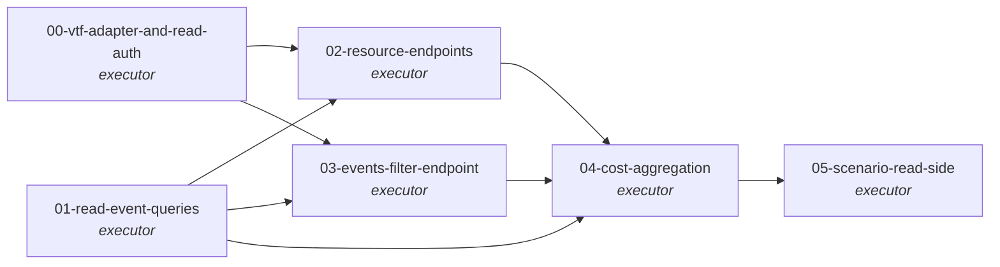

# Topology

- T0: Vtaskforge adapter (workgraph/task metadata fetch + whoami)
  + ReadAuth strategy (vtf-token piggyback with 60s hash cache).
  Foundation for everything else in WG2.
- T1: EventRepository read methods (find_by_workgraph,
  find_by_task, find_filtered, cost_summary). Pure data layer
  extension; no HTTP wire yet.
- T2: GET /workgraphs/<id> + GET /tasks/<id> + GET /tasks/<id>/events
  resource endpoints. Composes T0 (vtf metadata) + T1 (event reads)
  behind the ReadAuth dependency.
- T3: GET /events?filter=... global filtered query. Builds on T1's
  find_filtered with a query builder that maps URL params to
  EventQuery values.
- T4: Cost aggregation endpoints. GET /workgraphs/<id>/cost +
  GET /agents/<id>/cost. Strategy pattern over aggregation kind
  (sum/per-agent/per-task). Built on T1's cost_summary.
- T5: Scenario test extends the WG1 kind scenario — seeds N events,
  hits each read endpoint, asserts payloads + cost math.

# Why this DAG

The read side splits cleanly into: an upstream-adapter layer (T0),
a data-access layer (T1), three composed-endpoint layers (T2/T3/T4),
and a scenario validator (T5). Each is single-responsibility.

T0 + T1 are independent of each other (T0 talks to vtaskforge; T1
talks to vfobs's own Postgres) — parallel. T2 and T3 both compose
T0+T1 but serve different shapes; can be parallel after T0+T1 land.
T4 composes the cost path through T1 (which provides
`cost_summary` aggregation primitives) and reuses T2/T3 patterns
for query construction. T5 closes the loop.

# Engineering principles compliance

- **SOLID.** Adapter (T0 vtaskforge bridge), Strategy (T0 ReadAuth,
  T4 cost-aggregation kind), Repository (T1 extends WG1's
  EventRepository — additive, no breaking changes), DIP (endpoints
  depend on ReadAuth + EventRepository abstractions).
- **TDD red/green.** Every code-bearing task lists unit + integration
  + (where applicable) contract ACs.
- **Full testing pyramid.** Unit + integration at every code-bearing
  task; contract at T2/T3/T4 (public API surfaces); scenario at T5.
- **Extensibility affordances in v1.**
  - `org_id` filter param on `GET /events` (hardcoded `viloforge`
    default).
  - Aggregation kind is a Strategy — adding "per-project" rollups
    in v2 is one new impl, not an endpoint redesign.
  - ReadAuth interface admits OIDC / web-user auth in v2 by swapping
    strategy.

# Acceptance criteria (workgraph-level)

- WG-AC1 — All 6 task PRs merged to viloforge/vfobs:main.
- WG-AC2 — `make test-unit` + `make test-integration` + `make test-contract`
  pass on the merge commit. (Scenario via `make test-scenario`.)
- WG-AC3 — T5 scenario passes end-to-end: seeded events readable via
  each new endpoint with correct payloads and cost rollup math.
- WG-AC4 — vtf-token piggyback works (a valid vtf token authenticates
  to read endpoints; an invalid one returns 401; an unauthenticated
  request returns 401).
- WG-AC5 — Cost rollup at the workgraph level sums the **latest
  execution_summary per task** (the one on the highest-id
  summary-bearing `task.state_changed` event — verifier F2 de-dup),
  ignoring tasks that haven't produced an execution_summary yet and
  counting a reworked task once (no double-count, no NaN, no
  errors).
- WG-AC6 — vtaskforge project shows the 6 WG2 task records done.

# Cross-WG dependency

WG2 depends on WG1 (event store + write API) — see workgraph
frontmatter. v2 features (SSE WG3, anomaly WG4, SDK/CLI WG5)
depend on WG2's read-API surface.

# Out of scope

- **SSE streams.** WG3 work.
- **Workgraph DAG endpoint** (`GET /workgraphs/<id>/dag`). WG3.
- **Project-level cost rollups.** vfobs events don't carry
  `project_id` in v1; mapping workgraph → project requires either
  an event-schema bump (v2) or a vtaskforge lookup adapter. Defer.
- **Real-time cost burn-rate.** v2 (needs SSE).
- **Cost-anomaly detection** ("this task using 3× the average"). v2.
- **In-memory recent-events cache.** WG3 (SSE optimization).
- **CLI / SDK consumer methods.** WG5.

# References

- `viloforge-platform/docs/pipeline-observability-DESIGN.md` §E
  (read endpoints), §I (auth split), G8 (cost).
- `viloforge-platform/docs/pipeline-observability-IMPLEMENTATION-PLAN.md`
  v0.2 §6, §15 (OIQ3 read-half).
- `viloforge-platform/docs/engineering-principles.md` v1.0.
- `viloforge-projects/vfobs/workgraphs/foundation/` — WG1 design,
  completion, retros (the foundation this WG builds on).
- `vtf-methodologies/spec-author/bugfix.md` — applied including the
  new R13 (Pydantic mutation) + R14 (external-dep stability) rules
  freshly propagated from WG1 retro.
